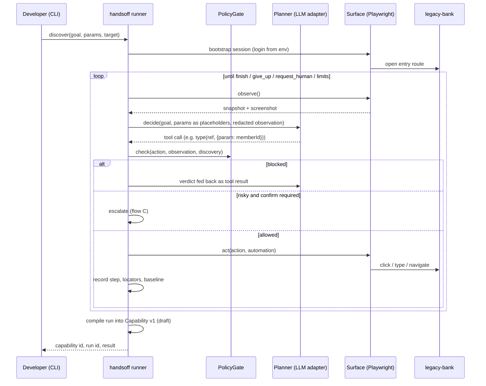

# 00 · Project Overview

Status: stable · Last updated: 2026-09-21

## 1. What HandsOff is

HandsOff gives AI agents hands inside software that has no API. It is the answer to the interface.ai take-home brief ([../description.md](../description.md)): a computer-use automation system for the back-office applications that banks and credit unions run, where the only way in is to drive the user interface the way a human operator would.

The brief's through-line is the whole design in three sentences:

> The model discovers. The artifact becomes a reusable capability. Deterministic replay is how the AI agent invokes it in production.

Concretely:

1. A caller hands HandsOff a **goal** in natural language, typed **parameters**, and a **target** application.
2. An LLM runs an observe → decide → act loop against the live UI until the goal is met. That run is recorded.
3. The run is **compiled** into a **capability**: a typed, versioned, reviewable artifact with input parameters, output extraction, ordered steps, robust element targeting, checkpoints, and the business outcomes it can produce.
4. From then on the capability **replays deterministically** with no model in the loop. Replay detects runtime conditions (not found, validation error, session expiry, interstitials, app errors) and returns a structured result that separates business outcomes from recoverable conditions and hard failures.
5. When automation cannot safely proceed, it **escalates**: an operator takes over the same live browser session, finishes or fixes the step, and hands control back. Their actions are recorded.
6. Throughout, a **policy gate** enforces an allowlist, treats irreversible actions conservatively, and redaction keeps regulated data out of artifacts and logs.

The name says what the system does: the model figures it out once, then takes its hands off.

### What we implement versus what we design

| Implemented against one concrete surface | Designed, with a real seam, not built |
|---|---|
| Web surface through Playwright, including framesets and table-based legacy markup | Desktop surface through OS accessibility APIs |
| Discovery loop, compile step, deterministic replay | Assisted fallback (one bounded LLM recovery step at replay); built only if time remains |
| Condition classifier with the full result contract | Remote operator co-browsing (session broker, screencast) |
| Policy gate, risk classification, redaction, evidence | Operator authentication, multi-operator contention |
| Escalation and headed-browser handoff with recorded human actions | Multi-tenant fleet management, drift dashboards |
| Operator console (inbox, run viewer, capability review) | |
| A second tenant variant of the mock app with per-variant overrides | |

## 2. Goals and non-goals

### Goals

Each goal maps to the brief section it satisfies and the architecture section that describes how.

| # | Goal | Brief | Where |
|---|---|---|---|
| G1 | Accept a goal plus target and run an LLM-driven loop against a real UI until done or a stop condition hits | §3.1 | [01 §6](01-architecture.md#6-discovery-loop) |
| G2 | Emit a typed, versioned, reviewable capability with inputs, outputs, steps, robust targeting and a success condition | §3.2 | [01 §7–8](01-architecture.md#7-compile-run--capability), [02](02-tech-stack-and-data-model.md) |
| G3 | Replay a capability with parameters and no LLM decisions; verify checkpoints; return declared outputs | §3.3 | [01 §9–10](01-architecture.md#9-one-condition-type-three-roles-one-classifier) |
| G4 | Detect runtime conditions and distinguish business outcomes, recoverable conditions and hard failures in the result | §3.3 | [01 §9–10](01-architecture.md#9-one-condition-type-three-roles-one-classifier) |
| G5 | Enforce an explicit allowlist; treat risky actions conservatively; never persist secrets or raw sensitive data | §3.4 | [01 §12](01-architecture.md#12-safety-and-policy) |
| G6 | Produce a structured log of what the agent did and why, plus richer evidence on failure | §3.5 | [01 §13](01-architecture.md#13-evidence-and-observability) |
| G7 | Detect stuck states, route an intervention request with context, let a human control the same session, hand back, record what they did | §3.6 | [01 §11](01-architecture.md#11-control-transfer-and-escalation) |
| G8 | Keep the abstractions open to legacy web and desktop surfaces and to reuse across tenants running the same vendor app | §3.7 | [01 §5, §14](01-architecture.md#5-seams) |
| G9 | Ship the exact deliverables: `/README.md`, `/REPORT.md` with seven headings, `/evidence/` | §6 | [04-roadmap.md](04-roadmap.md) P8 |

### Non-goals

Taken from brief §5 and §7, which say what is not rewarded.

- No queues, clusters, worker pools or multi-tenant plumbing. One process, files on disk.
- No desktop automation implementation. The seam exists; the adapter does not.
- No polished operator console and no operator authentication. The console is real but minimal.
- No real bank system, no real credentials, no real personal data anywhere. The target is a mock we own.
- No feature breadth for its own sake. Every capability of the system is thin-but-real rather than a polished subset.
- No LLM on the replay path except the single bounded recovery step, and that only if the stretch is built.

## 3. Glossary

Terms from the brief (§10) first, then terms HandsOff adds.

| Term | Meaning here |
|---|---|
| Computer use | An LLM operating a UI the way a person would: reading the screen, clicking, typing. |
| Surface | Anything that can be observed and acted on: a web page, a legacy frameset, a desktop window. HandsOff talks to a surface only through the `Surface` interface. |
| Accessibility tree | The parallel representation browsers and operating systems expose for screen readers. HandsOff's primary way of seeing a surface. |
| Observation | One snapshot of a surface: accessibility nodes with refs, a screenshot, URL, title, open dialogs. Surface-agnostic by design. |
| Locator / target | How a step says which control to act on. A `TargetSpec` holds an ordered list of strategies. |
| Checkpoint | A condition asserted after a step to confirm the expected state was actually reached. In HandsOff this is a step's postcondition. |
| Deterministic replay | Re-running a capability the same way every time with no model deciding anything. |
| Business outcome | A legitimate answer the caller needs, such as "no such member". Not a crash. First-class in the result contract. |
| Recoverable condition | Something replay handles itself within a budget: dismiss a known interstitial, wait out slowness, re-login after session expiry. Recorded as an event, never returned as a result. |
| Hard failure | Replay cannot continue and the caller gets a structured, debuggable error. |
| Tenant | One customer institution. Many tenants run the same vendor product configured differently. |
| Drift | A change in the UI or environment that makes a recorded capability resolve differently than at discovery. |
| **Capability** | HandsOff's artifact: the typed, versioned, replayable description of one flow. What a calling agent invokes. |
| **App Profile** | Per vendor product: the login routine, shared condition detectors, and the known variants. Capabilities bind to a profile, not to a tenant. |
| **Variant** | One tenant's configuration of a vendor product, identified by a fingerprint, with overrides to apply on top of a capability. |
| **Condition** | A predicate over an observation, used in three roles: a step's precondition, a step's postcondition, or a detector with a class (`outcome`, `recover`, `fail`, `escalate`). |
| **Classifier** | The one ordered function that evaluates conditions after each step and decides: proceed, recover, return an outcome, or fail. |
| **Control owner** | Who may act on a session right now: `automation`, `awaiting_operator`, `human`, or `aborted`. Engines refuse to act unless they own control. |
| **Escalation** | An intervention request raised to an operator, carrying enough context to act, and the record of what they did. |
| **Recovery** | One handled recoverable condition, recorded with what triggered it and what was done. |
| **Side-effect state** | Whether a risky step executed before the run stopped: `none`, `possible`, `committed`. |
| **Policy gate** | The single check every action passes before it executes: allowlist, action type, and live risk classification. |
| **Evidence** | The run folder: event log, screenshots, redacted transcript, result. Curated copies live in `/evidence/`. |

## 4. Actors

| Actor | What they do | Touchpoints |
|---|---|---|
| Calling agent | Invokes a capability by name with typed arguments and consumes the structured result. In the demo this is the CLI or the console's replay form. | `handsoff replay`, replay API |
| Operator | Answers escalations: reads the intervention request, takes control of the live browser, fixes or completes the step, hands back. | Operator console, headed browser window |
| Reviewer | Inspects a draft capability, checks its steps, targets, risk tags and outputs, and approves it for unattended replay. | Operator console, capability JSON |
| Developer | Builds and runs the system, records discoveries, curates evidence, writes the report. | CLI, docs, repo |

## 5. User flows

### A. Discover

Input: goal text, typed parameters with concrete values, target (app profile, variant, entry route). Output: a draft capability and a run folder.

Steps in words:

1. The runner starts the browser, runs the app profile's login routine with credentials from the environment, and opens the entry route.
2. Each turn the runner observes the surface, redacts the observation, and asks the planner what to do. Parameters are shown to the model as named placeholders, never as values.
3. Every proposed action passes the policy gate. Blocked actions are returned to the model as a tool result explaining why. Risky actions either escalate or are blocked according to policy.
4. Allowed actions execute. The runner records the step with every locator strategy it can derive from the resolved element, which strategy resolved and how many candidates matched, and a before and after observation digest.
5. The loop stops on `finish(outputs)`, `give_up`, `request_human`, the step limit, the time limit, or the stuck detector.
6. On success the run is compiled into a draft capability. On any other stop the run folder still holds full evidence.

### B. Replay

Input: capability id and version, parameter values, target variant. Output: a `ReplayResult`.

1. Load the capability and the app profile. Detect the variant by fingerprint after bootstrap; apply overrides.
2. Check the capability's entry preconditions.
3. For each step: check preconditions, resolve the target through the strategy list, pass the policy gate (live risk classification), act, wait, observe, run the classifier.
4. The classifier decides: proceed to the next step; run a recovery routine within budget and re-check; stop with a business outcome; or stop with a failure. Escalation-class conditions and exhausted budgets hand off to flow C.
5. After the last step, verify the success condition, extract outputs using the output specs, mask sensitive outputs in the persisted result, and return.

### C. Escalate and hand off

Triggered from discovery or replay when the planner asks for a human, the stuck detector fires, a condition is classed `escalate`, a risky step requires operator confirmation, or a recovery budget is exhausted.

1. The engine writes an intervention request to the run folder and pushes it to the console. Control owner becomes `awaiting_operator`. The engine stops acting.
2. An operator opens the escalation in the console, reads the cause, the current step and intent, and the latest screenshot, then claims it. Control owner becomes `human`.
3. The operator works directly in the headed browser window, which is the same session automation was using. The surface's injected script reports each click, input and submit back to the runner, which records them as steps tagged `actor: human`.
4. The operator hands back with one of three choices: **resume** (the engine scans step postconditions to find where the human left the flow, then continues), **mark complete** (the engine re-extracts outputs from the live page using the capability's output specs), or **abort**.
5. Control owner returns to `automation` or `aborted`. The result carries an `escalation` block with the human's actions and the resolution. If nobody claims within the timeout, the run ends with `ESCALATION_ABANDONED`.

### D. Review and approve

1. A reviewer opens a draft capability in the console: inputs, outputs, each step's intent, target strategies, risk tag and confirm setting, the detectors, and the discovery run it came from.
2. They may edit nothing in place; changes come from a new discovery or a hand-edited new version that `supersedes` the old one.
3. Setting status to `approved` unlocks unattended replay of risky steps that are marked `confirm: none`. Steps marked `confirm: operator` still pause for a human.

### E. Cross-tenant replay

1. The mock app runs variant A and variant B side by side with different branding, labels and column order.
2. A capability recorded on A is replayed against B. Fingerprinting identifies B; its overrides (label maps, per-step target replacements, route rewrites) apply.
3. The result reports which strategy resolved each step, so the operator can see whether B needed deeper fallbacks than A. An unknown fingerprint is reported as drift, not silently attempted.

## 6. Demo storyline

The mock target is a fictional vendor product, **ACME CoreTeller**, deployed by two fictional institutions: variant A "First Example Credit Union" and variant B "Sample Federal Credit Union". No real institution, product or person is referenced anywhere. Member data is synthetic. Member `10001` exists; member `99999` does not.

Two capabilities are recorded and replayed:

| Capability | Inputs | Outputs | Path through the app | Risky | Outcomes exercised |
|---|---|---|---|---|---|
| `get-member-savings-balance` | `memberId` (sensitive) | `savingsBalance` (currency, sensitive) | Member search → member detail → read the Savings row of the accounts table | No | `MEMBER_NOT_FOUND` |
| `open-sub-account` | `memberId` (sensitive), `accountType` | `confirmationNumber` | Member search → member detail → Open sub-account → choose type → submit → confirmation screen | Yes, the submit step carries `confirm: operator` | `MEMBER_NOT_FOUND`, `VALIDATION_REJECTED` |

Injectable runtime conditions in the mock app, each mapped to a condition class:

| Condition | How injected | Class | What replay does |
|---|---|---|---|
| Member not found | Search for `99999` | `outcome` | Stops, returns `MEMBER_NOT_FOUND` |
| Validation error | Submit with an invalid account type | `outcome` | Stops, returns `VALIDATION_REJECTED` with the page's message |
| Session expiry | Short cookie lifetime via chaos switch | `recover` | Re-runs the bootstrap routine once, re-verifies the previous checkpoint, continues |
| Unexpected interstitial | "System notice" modal injected on page load | `recover` | Dismisses it, re-checks the step |
| Slow load (optional) | Delay middleware | `recover` | Waits within the step timeout, then retries once |
| Server error page (optional) | Forced 500 | `fail` | Stops with `APP_ERROR` and the page evidence |
| Stuck / unknown state | Anything the classifier cannot name | `escalate` | Raises an intervention request |

Evidence produced for the submission: one real discovery run, one successful replay, one `MEMBER_NOT_FOUND` replay, one escalation with handoff, one cross-variant replay, and the capability JSON.

## 7. Evaluation traceability

How the brief's evaluation criteria (§7) and requirements (§3) map onto HandsOff.

| Brief | Requirement in short | HandsOff component | Doc |
|---|---|---|---|
| §3.1 | Goal-driven agent loop on a real UI, no clean-DOM assumption | Discovery engine + `Planner` + `Surface` (a11y tree and screenshot) | [01 §5–6](01-architecture.md#5-seams) |
| §3.2 | Typed, versioned, reviewable artifact with inputs, outputs, steps, targeting, checkpoint | `Capability` schema, compile step, three-strategy `TargetSpec` | [01 §7–8](01-architecture.md#7-compile-run--capability), [02 data model](02-tech-stack-and-data-model.md) |
| §3.3 | Deterministic replay; runtime error detection; outcome vs recoverable vs failure; structured result | Replay engine, `Condition` classifier, `ReplayResult` | [01 §9–10](01-architecture.md#9-one-condition-type-three-roles-one-classifier) |
| §3.4 | Allowlist; risky vs safe; no secrets or PII persisted | `PolicyGate`, act-time risk, `Redactor` | [01 §12](01-architecture.md#12-safety-and-policy) |
| §3.5 | Structured log plus richer failure evidence | Run folder, event log, screenshots | [01 §13](01-architecture.md#13-evidence-and-observability) |
| §3.6 | Detect stuck, route with context, human controls the live session, hands back, actions recorded | Control owner state machine, escalation, headed handoff, `captureHumanActions` | [01 §11](01-architecture.md#11-control-transfer-and-escalation) |
| §3.7 | Extends to legacy web and desktop; reuse across tenants; drift | `Surface` seam, `AppProfile`, variants, resolution baseline | [01 §5, §14](01-architecture.md#14-heterogeneity-and-multi-tenant) |
| §4 | A real LLM-driven discovery run with evidence | Phase P2 in the roadmap, `/evidence/discovery-run/` | [04-roadmap.md](04-roadmap.md) |
| §6 | `/README.md`, `/REPORT.md` with seven headings, `/evidence/` | Phase P8 | [04-roadmap.md](04-roadmap.md) |
| §7 code quality | Typed, tested where it counts, easy to run | Classifier, resolver, policy gate and schema tests; one-command demo | [07-code-standards.md](07-code-standards.md) |

Mandated deliverable paths, verbatim from brief §6:

- `/README.md` with setup, keys and config, how to run without live services, and the exact demo commands.
- `/REPORT.md` of one to three pages with exactly these headings, in order: 1. Architecture · 2. Artifact schema · 3. Determinism & error handling · 4. Heterogeneity & multi-tenant · 5. Escalation & handoff · 6. Safety · 7. Cuts.
- `/evidence/` with a saved capability, logs from a discovery run and a replay run, and ideally one replay that hits an error or exceptional state.

## 8. Known cuts

Decided now so they are deliberate, not accidental. Each will be restated in REPORT §7 with what we would build next.

| Cut | Why | What we would build next |
|---|---|---|
| Headed-browser handoff instead of remote co-browsing | Brief §3.6 scopes the console out; the same-machine handoff is real and far cheaper ([D-012](08-decision-log.md#d-012--handoff-via-the-headed-browser-with-captured-human-actions-no-screencast)) | Session broker owning browsers; CDP screencast or VNC bridge; operator auth and audit trail |
| Desktop surface designed only | Brief §3.7 asks for design, not implementation | A `desktop-a11y` surface over Windows UI Automation using the same `Observation` and `TargetSpec` shapes |
| One tenant variant | Enough to prove the override model | Fingerprint registry, per-variant replay health, drift alerts |
| Assisted fallback built only if time remains | The design is the interesting part; it reuses the discovery loop ([D-008](08-decision-log.md#d-008--stretch-goals-variant-b-built-assisted-fallback-designed-built-if-time)) | Enable the `RecoveryPlanner` port with a policy budget |
| Four chaos modes required, two optional | They cover every condition class ([D-024](08-decision-log.md#d-024--chaos-modes-four-required-two-optional)) | Permission-denied switch, randomised chaos for stability testing |
| No confidence scoring or approval workflow beyond a status field | Not required; the status field is the seam | Replay-history stability score gating `approved` |
