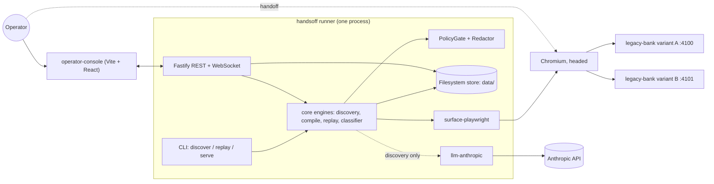
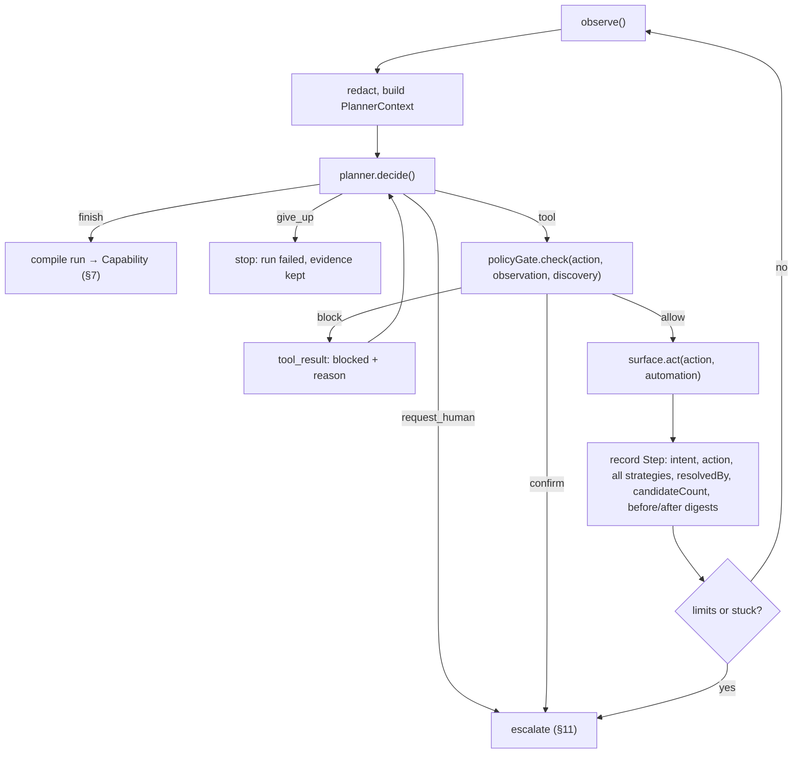
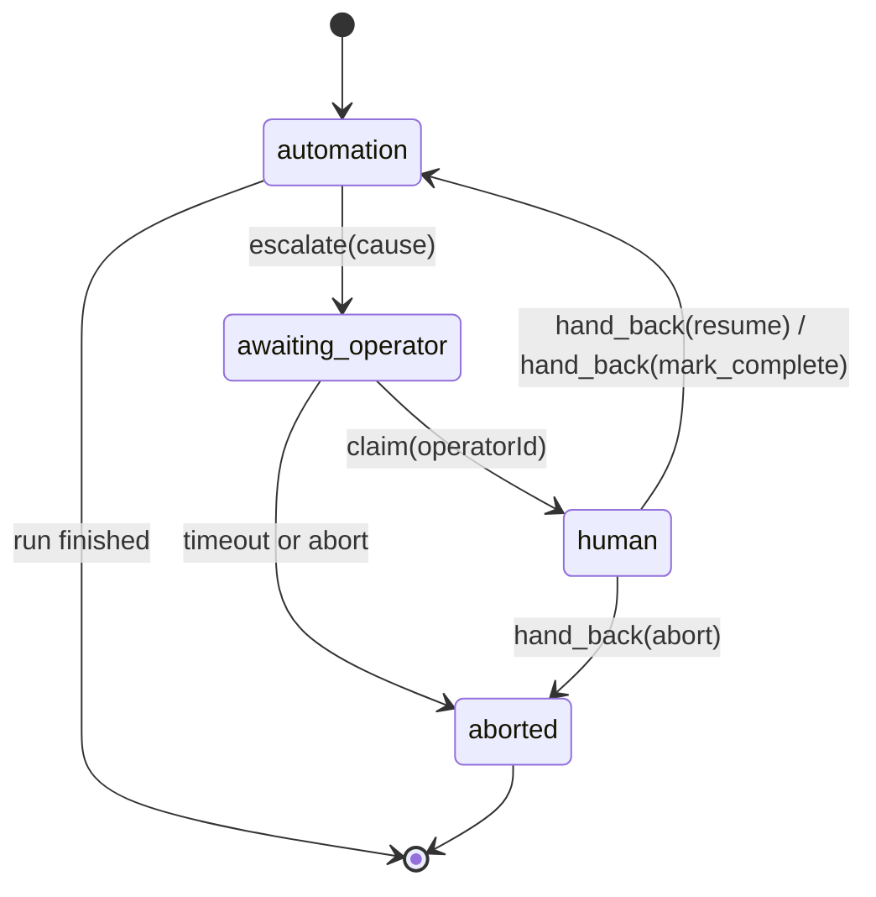

# 01 · Architecture

Status: stable · Last updated: 2026-09-21

This is the load-bearing document. It describes how HandsOff is put together, where the seams are, and why. Every section that makes a choice links to its entry in [08-decision-log.md](08-decision-log.md). Schemas are sketched here and defined in full in [02-tech-stack-and-data-model.md](02-tech-stack-and-data-model.md).

## 1. Principles

1. **The model is in the loop only at discovery.** Replay is deterministic. The single exception is the optional, bounded assisted-fallback step (§15), and the dependency graph makes any other model call impossible ([D-023](08-decision-log.md#d-023--core-has-no-runtime-dependencies-llm-adapter-is-a-separate-package)).
2. **Every seam is an interface in `@handsoff/core`.** Surface, planner, store, policy gate and redactor are ports. Runtime-specific code (Playwright, the Anthropic SDK, the filesystem) lives in adapter packages.
3. **Errors are data across seams.** Engines return discriminated unions. Exceptions mean bugs, not business conditions.
4. **Evidence is a by-product of the normal path.** Every observation, decision, policy verdict, action and condition is an event in the run log. Nothing is added "for debugging" later.
5. **Thin-but-real for every brief requirement; design for scale, do not build it.** Where we stop, there is a named interface and a paragraph on what the real-scale version looks like.

## 2. Topology



One process, the **runner**, does everything that touches the live session ([D-011](08-decision-log.md#d-011--one-runner-process-the-cli-embeds-the-api-and-console)):

- `handsoff discover` and `handsoff replay` run the engines in-process, own the Playwright browser, write to `data/`, and start an embedded Fastify server on `:4000` so the operator console can attach if an escalation happens. The server stops when the run ends unless `--keep-alive` is set.
- `handsoff serve` starts the server alone for browsing runs and capabilities and for triggering replays from the console.
- The console is a static build served by the same Fastify instance; during development Vite runs on `:5173` and proxies `/api` and `/ws` to `:4000`.
- The mock target runs separately: variant A on `:4100`, variant B on `:4101`.
- The browser runs **headed** by default so an operator can take over the window. Tests pass `--headless`.

Why one process: the live session, the engines and the operator controls must share memory for the handoff to be the same session and not a reconnection. The brief accepts a single process when justified (§4) and does not reward service plumbing (§7).

At real scale: a **session broker** owns browser contexts and exposes them to stateless runner workers; escalations go through a queue; the console talks to the broker. Every one of those boundaries already exists here as an interface (`Surface`, `Store`, the escalation record), so the split is a deployment change, not a redesign.

## 3. Package map and dependency rules

| Path | Package | Contains | May depend on |
|---|---|---|---|
| `packages/core` | `@handsoff/core` | Schemas (zod), domain types, discovery engine, compile, replay engine, classifier, policy gate, redactor, evidence recorder, control-owner state machine, `ScriptedPlanner`, filesystem `Store` | zod, Node built-ins only |
| `packages/surface-playwright` | `@handsoff/surface-playwright` | `Surface` implementation: observe, act, resolve, human-action capture, frame walking | core, playwright |
| `packages/llm-anthropic` | `@handsoff/llm-anthropic` | `Planner` and `RecoveryPlanner` implementations, prompt construction, tool schemas | core, `@anthropic-ai/sdk` |
| `apps/runner` | `@handsoff/runner` | Binary `handsoff`; wires adapters into engines; embedded Fastify API and WebSocket; serves the console build | core, surface-playwright, llm-anthropic, fastify |
| `apps/operator-console` | `@handsoff/operator-console` | Vite + React console | core (types only) |
| `apps/legacy-bank` | `@handsoff/legacy-bank` | Express + EJS mock target, chaos injection, variant B | nothing from the workspace |

Rules:

- `core` imports **nothing** runtime-specific. No Playwright, no Anthropic SDK, no Fastify ([D-023](08-decision-log.md#d-023--core-has-no-runtime-dependencies-llm-adapter-is-a-separate-package)).
- The replay engine in `core` takes an optional `RecoveryPlanner`. If none is injected, replay has no path to a model at all.
- `legacy-bank` shares nothing with the rest of the workspace. It stands in for software we do not own.
- The console imports types from `core` and nothing else; all data comes over the API.

## 4. Core domain model

| Concept | One line | Defined in |
|---|---|---|
| **Goal** | Natural-language task plus typed parameters with values, given to discovery | 02 |
| **Target** | App profile id, optional variant id, entry route | 02 |
| **Session** | A browser context plus its `controlOwner` | §11 |
| **Run** | One discovery or replay execution: events, screenshots, result | §13 |
| **Capability** | The artifact: inputs, outputs, steps, conditions, policy, variants, provenance | §7, 02 |
| **Step** | One action on one target with preconditions, a postcondition, risk and confirm settings, and the discovery baseline | §8, 02 |
| **TargetSpec** | Ordered locator strategies plus frame path | §8 |
| **Condition** | A predicate over an observation, in the role of precondition, postcondition or detector | §9 |
| **Invocation** | Capability + parameters → `ReplayResult` | §10 |
| **Escalation** | An intervention request, who claimed it, what they did, how it resolved | §11 |
| **Policy** | Allowlist, action allowlist, risky patterns, modes, budgets | §12 |
| **AppProfile** | Per vendor product: bootstrap routine, shared detectors, variants | §14 |

## 5. Seams

The interfaces below are the whole answer to brief §3.7's "surface abstraction" question. Everything above them is surface-agnostic; everything below them is a replaceable adapter.

```ts
interface Surface {
  observe(): Promise<Observation>;
  act(action: Action, actor: Actor): Promise<ActResult>;
  resolve(target: TargetSpec): Promise<Resolution>;
  captureHumanActions(onStep: (step: RecordedStep) => void): Disposable;
  info(): SurfaceInfo; // { kind: 'web' | 'legacy-web' | 'desktop-a11y', ... }
}

interface Observation {
  at: string;                 // ISO timestamp
  url?: string;               // web only; desktop reports window title + screen id
  title: string;
  nodes: A11yNode[];          // flattened accessibility tree
  dialogs: DialogInfo[];      // open modal/alert/confirm dialogs
  screenshot: ScreenshotRef;  // PNG path or buffer, already masked by the Redactor
  digest: string;             // stable hash of the semantically relevant parts, for change detection
}

interface A11yNode {
  ref: string;                // "e12", stable within one observation only
  role: string;               // button, textbox, cell, link, ...
  name: string;               // accessible name
  value?: string;             // masked if bound to a sensitive param
  states: string[];           // focused, disabled, checked, expanded, ...
  bbox: { x: number; y: number; w: number; h: number };
  framePath: string[];        // [] for top document; ["main"] for frame named main; ["nav", "sub"] nested
  parentRef?: string;
}

type Action =
  | { kind: 'click';    target: TargetRef }
  | { kind: 'type';     target: TargetRef; value: Value; clear?: boolean }
  | { kind: 'select';   target: TargetRef; value: Value }
  | { kind: 'press';    key: string }
  | { kind: 'navigate'; url: Value }
  | { kind: 'wait';     reason: string; ms?: number }
  | { kind: 'extract';  name: string; target: TargetRef };

type Value = { text: string } | { param: string };            // D-013
type TargetRef = { ref: string } | { spec: TargetSpec };       // ref during discovery, spec during replay
type Actor = 'automation' | 'human';

interface Planner         { decide(ctx: PlannerContext): Promise<Decision>; }
type Decision =
  | { kind: 'tool'; action: Action; intent: string }
  | { kind: 'finish'; outputs: Record<string, Value | { ref: string }>; summary: string }
  | { kind: 'give_up'; reason: string }
  | { kind: 'request_human'; reason: string };

interface RecoveryPlanner { proposeOne(ctx: RecoveryContext): Promise<Action | null>; }

interface Store {
  capabilities: { get; put; list; latest };
  runs:         { create; appendEvent; putScreenshot; finish; get; list };
  escalations:  { create; update; get; list };
  appProfiles:  { get; list };
}

interface PolicyGate { check(action: Action, observation: Observation, phase: 'discovery' | 'replay', step?: Step): Verdict; }
type Verdict =
  | { kind: 'allow'; risk: 'safe' | 'risky' }
  | { kind: 'block'; rule: string; reason: string }
  | { kind: 'confirm'; rule: string; reason: string };  // risky and requires an operator

interface Redactor {
  observation(o: Observation, bindings: Binding[]): Observation;
  screenshot(png: Buffer, regions: Bbox[]): Buffer;
  params(p: Record<string, unknown>, inputs: InputSpec[]): Record<string, unknown>;
  transcript(messages: unknown[]): unknown[];
}
```

Why the `Observation` shape is surface-agnostic: a flattened list of nodes with role, name, value, states, bounding box and container path is exactly what Playwright's accessibility snapshot, Windows UI Automation and macOS Accessibility all produce, and it is also what a vision model can be asked to emit from a screenshot. Nothing above the seam knows about the DOM.

How the action vocabulary maps across surfaces:

| Action | Web / legacy web | Desktop (`desktop-a11y`, designed) |
|---|---|---|
| `click`, `type`, `select`, `press` | Playwright on the resolved element | UI Automation invoke / value / selection patterns |
| `navigate` | Go to URL | `openScreen`: menu path or window activation; URL patterns become screen ids |
| `wait` | Bounded wait for load state or element | Bounded wait for window or control state |
| `extract` | Accessible name or value of the element | Same |
| `framePath` | Frame names or indices | Window → pane → container automation ids |

How each locator strategy (§8) travels:

| Strategy | Web | Legacy web (framesets, tables) | Desktop |
|---|---|---|---|
| `role` | role + accessible name | same, scoped by `framePath` | control type + name |
| `anchored` | label text → control; row header → column | the workhorse: table cell text → sibling cell | label → control; grid row → column |
| `structural` | frame path + positional path | same | automation-id or tree path |

## 6. Discovery loop



1. **Bootstrap.** The runner launches the browser, runs the app profile's bootstrap routine (login using credentials from the environment; the routine is part of the profile, never of a capability), and opens the entry route. The variant is fingerprinted here.
2. **Planner context.** Each turn the model receives: the goal; the parameter list as `{ name, type, description }` **without values**; the redacted observation as a compact text rendering of the accessibility nodes (`[e12] button "Search"`) plus the masked screenshot; a summary of steps taken so far; and the remaining step budget.
3. **Decision.** The planner returns one tool call, or one of `finish`, `give_up`, `request_human`. The tool schemas are the `Action` union above with `Value = { text } | { param }`. Whenever the model wants to use a parameter it writes `{ param: "memberId" }`; the surface substitutes the real value at act time. This is the whole parameterisation story ([D-013](08-decision-log.md#d-013--parameters-bound-by-provenance-not-by-value-matching)): the binding is recorded at the moment the value is used, and sensitive values never enter the transcript.
4. **Policy gate.** Blocked actions are returned to the model as a tool result that states the rule, so it can pick another route. A `confirm` verdict escalates (§11) if policy says `discovery: escalate`, or is treated as a block if `discovery: block`.
5. **Act and record.** The surface resolves the ref to a live element, performs the action, then the runner derives every locator strategy it can from that element (§8), records which strategy would have resolved it and how many candidates matched (the **baseline**), and stores before and after observation digests.
6. **Stop conditions.** `finish` with outputs (each output is a `{ ref }` to extract from or a `Value`); `give_up`; `request_human`; `HANDSOFF_MAX_STEPS`; wall-clock timeout; the **stuck detector**: three consecutive identical actions, or three consecutive actions after which the observation digest did not change.

Model invocation details (adaptive thinking, effort, image blocks, `stop_reason` handling) live in [02](02-tech-stack-and-data-model.md#llm-integration). The loop is written by hand rather than with the SDK tool runner because each tool result is a fresh observation and every action passes the gate first ([D-022](08-decision-log.md#d-022--manual-tool-use-loop-on-sdk-types-not-the-beta-tool-runner)).

## 7. Compile: Run → Capability

Compile is deterministic and rule-based ([D-021](08-decision-log.md#d-021--compile-is-rule-based-no-llm-at-compile-time)). Every field in the artifact is traceable to a recorded event.

1. **Prune.** Drop `wait` steps and steps whose only effect was undone by an immediate back-navigation. Keep everything else; a reviewer can delete more in a new version.
2. **Bind.** `Value.param` uses become `bindings[]` on the step. URL segments equal to a parameter value (whole segment only) become `:name` in the route and a binding marked `inferred: true`.
3. **Targets.** Each step's recorded strategies become its `TargetSpec`, ordered by the ranking in §8, with the discovery `baseline`.
4. **Postconditions.** From the before and after observation deltas of each step: URL changed to a pattern; a heading or title appeared; a specific element appeared. The most specific delta becomes the step's postcondition. The last step's postcondition becomes the capability's `success` condition unless `finish` named a better one.
5. **Outputs.** `extract` calls and `finish` output refs become `outputs[]` with a `source` `TargetSpec`, a type, an optional parser (`currency`, `date`, `text`), and a sensitivity inherited from the input it derives from or declared in the goal.
6. **Risk and confirm.** The policy gate's verdict at discovery time becomes the step's `risk`. Steps that were confirmed by an operator during discovery get `confirm: 'operator'`.
7. **Detectors.** The capability starts with references to the app profile's shared detectors plus any business outcome the goal declared (for example `MEMBER_NOT_FOUND`) with the observation predicate the developer supplies or that the model reported when it hit that state during discovery.
8. **Provenance.** Run id, model id, effort, timestamp, variant id, tool version.

Output: `Capability` with `version: 1`, `status: 'draft'`.

## 8. Target resolution

A `TargetSpec` is an ordered list of up to three strategies plus the frame path ([D-016](08-decision-log.md#d-016--three-locator-strategies-with-a-recorded-resolution-baseline)):

```ts
interface TargetSpec { strategies: Strategy[]; framePath: string[] }

type Strategy =
  | { kind: 'role';       role: string; name: string; exact?: boolean }
  | { kind: 'anchored';   anchor: string; relation: 'labels' | 'same-row-column' | 'right-of' | 'below'; column?: string; role?: string }
  | { kind: 'structural'; path: string };   // e.g. "table[2] > tr[3] > td[4] > input[1]"
```

1. **`role`** — role plus accessible name, scoped by frame. Works wherever an accessibility tree exists. Defeated by duplicate names ("Edit" on every row) and by legacy controls with no label association.
2. **`anchored`** — relative to stable visible text. `{ anchor: 'Member #', relation: 'labels' }` is the input next to that label even when there is no `<label for>`. `{ anchor: 'Savings', relation: 'same-row-column', column: 'Balance' }` is the cell in the row whose leading cell says Savings, under the Balance header. This is the legacy-table workhorse: it survives column reordering, missing ids and nested tables, and it is the strategy that translates most directly to desktop grids. Defeated by relabelling (handled by variant label maps, §14).
3. **`structural`** — frame path plus positional path. Last resort. Survives when text and roles are missing; defeated by any layout change.

Resolution algorithm: walk the strategies in order; a strategy succeeds only if it matches **exactly one** visible, enabled element; record `resolvedBy` (index) and `candidateCount`. Compare with the step's discovery `baseline`: a deeper index or `candidateCount > 1` at a shallower one raises a `drift` event and, if policy says so, `DRIFT_SUSPECTED`. No match after all strategies is `TARGET_NOT_FOUND` with the strategies tried and the nearest candidates as evidence.

Visual anchoring (a bounding box plus a screenshot hash) is deliberately not a strategy. Coordinates are stalest exactly when they are needed. It remains a documented seam for screenshot-only surfaces where no tree exists.

## 9. One `Condition` type, three roles, one classifier

A `Condition` is a predicate over an observation ([D-014](08-decision-log.md#d-014--one-condition-type-in-three-roles-one-ordered-classifier)).

```ts
interface Condition {
  id: string;
  when: Predicate;
  role: 'precondition' | 'postcondition' | 'detector';
  class?: 'outcome' | 'recover' | 'fail' | 'escalate';  // detectors only
  code?: string;            // outcome code (MEMBER_NOT_FOUND) or failure kind
  message?: string;         // human-readable, may include an extraction {{ref}} from the page
  recovery?: RecoveryRoutine;                             // class 'recover' only
  atSteps?: string[];       // limit a detector to certain steps; default all
  terminal?: boolean;       // outcome ends the run (default true)
}

interface Predicate {
  url?: string;             // glob or :param pattern
  textPresent?: string[];   // all must be present in accessible names/values
  textAbsent?: string[];
  element?: TargetSpec;     // must resolve uniquely
  dialog?: boolean;         // a modal/alert/confirm is open
  frameTitle?: string;
  timeoutMs?: number;       // for waits: how long to keep checking before the predicate is considered false
}

type RecoveryRoutine =
  | { kind: 'dismiss'; target: TargetSpec }
  | { kind: 'wait-retry'; ms: number; maxAttempts: number }
  | { kind: 'rebootstrap' }
  | { kind: 'assisted' };   // §15, requires a RecoveryPlanner and policy permission
```

Roles:

- **Precondition** on a step: checked before acting. Failure is `UNEXPECTED_STATE` unless a detector explains it first.
- **Postcondition** on a step: the checkpoint. Checked after acting, with `timeoutMs` acting as the wait.
- **Detector**: evaluated after every observation. Sources are the app profile (session expired, error page, known interstitials; shared by every capability on that product) and the capability itself (business outcomes such as `MEMBER_NOT_FOUND`, `VALIDATION_REJECTED`).

The **classifier** is one ordered function:

```ts
classify(observation, step, budgets): 
  | { kind: 'proceed' }
  | { kind: 'recover'; routine: RecoveryRoutine; condition: Condition }
  | { kind: 'outcome'; code: string; message: string; data?: unknown }
  | { kind: 'fail'; failure: FailureKind; expected: string; observed: string }
  | { kind: 'escalate'; cause: EscalationCause }
```

Precedence, highest first:

1. Session-level and fatal detectors (`rebootstrap`-class recoveries, `fail`-class error pages). A session-expired page that also happens to contain the word "error" is a session expiry.
2. Known interstitials (`dismiss`-class).
3. Business outcomes (`outcome`-class) limited to their `atSteps`.
4. `escalate`-class detectors.
5. The step's postcondition: satisfied → `proceed`; not satisfied within `timeoutMs` → `CHECKPOINT_FAILED`.

Budgets are explicit and enforced by the classifier, not by the caller: at most **two recoveries per step** and **one re-bootstrap per run**. Exhaustion converts a `recover` into a `fail` or, if policy says so, an `escalate`. This is what stops a recovery loop from masking a stuck run.

The classifier is pure: it takes an observation and returns a decision. It is tested over saved observation fixtures from the mock app without a browser, which is where "tested where it counts" (brief §7) is spent.

How the runtime conditions in brief §3.3 are handled:

| Runtime condition | Detector source | Class | Response |
|---|---|---|---|
| Validation error | capability | `outcome` `VALIDATION_REJECTED` | Stop; return the page's message as `data` |
| Record not found | capability | `outcome` `MEMBER_NOT_FOUND` | Stop; return outcome |
| Permission denied | app profile | `outcome` `PERMISSION_DENIED` | Stop; return outcome |
| Unexpected confirmation or notice dialog | app profile | `recover` `dismiss` | Dismiss, re-observe, re-classify; budget 2 |
| Session or timeout expiry (login page appears) | app profile | `recover` `rebootstrap` | Re-login once, re-verify the previous step's postcondition, continue |
| Transient slowness | step postcondition `timeoutMs` + app profile | `recover` `wait-retry` | Wait within timeout, retry once |
| App error page (500) | app profile | `fail` `APP_ERROR` | Stop with screenshot and snapshot |
| Target missing after all strategies | resolver | `fail` `TARGET_NOT_FOUND` | Stop; strategies tried and nearest candidates in evidence |
| Anything else unexplained | none matched, postcondition unmet | `fail` `CHECKPOINT_FAILED` or `escalate` per policy | Stop or hand off |

## 10. Result contract

```ts
type ReplayResult = (
  | { status: 'success'; outputs: Record<string, unknown> }
  | { status: 'outcome'; code: string; message: string; data?: unknown }
  | { status: 'failure'; kind: FailureKind; expected: string; observed: string }
) & {
  capability: { id: string; version: number };
  variantId?: string;
  atStep?: string;                 // where the run stopped, if not at the end
  stepsRun: StepReport[];          // { stepId, attempts, durationMs, resolvedBy, candidateCount, driftFlag }
  recoveries: Recovery[];          // every handled recoverable condition
  sideEffects: 'none' | 'possible' | 'committed';
  escalation?: { id: string; humanActions: RecordedStep[]; resolution: 'resumed' | 'completed_by_human' | 'aborted' };
  evidence: EvidenceRef;           // run folder path and key screenshot paths
};

type FailureKind =
  | 'TARGET_NOT_FOUND' | 'CHECKPOINT_FAILED' | 'UNEXPECTED_STATE' | 'APP_ERROR'
  | 'TIMEOUT' | 'POLICY_BLOCKED' | 'DRIFT_SUSPECTED' | 'ESCALATION_ABANDONED';
```

Design points ([D-018](08-decision-log.md#d-018--three-terminal-result-statuses-escalation-is-metadata-sideeffects-field)):

- **Three terminal statuses.** `outcome` is a legitimate business answer, not an error. The brief (§10) calls conflating the two the most common design mistake; the type makes it impossible to do by accident.
- **Recoverables are events, not results.** A run that dismissed an interstitial and re-logged in once is still a `success`; the `recoveries` array says what happened.
- **Escalation is metadata.** After a human intervenes, the caller still gets `success`, `outcome` or `failure`. If nobody claims the escalation within the policy timeout the result is `failure` / `ESCALATION_ABANDONED`.
- **`sideEffects`** is derived: `none` if no risky step executed; `committed` if a risky step's postcondition was confirmed; `possible` if a risky step was executed but the run stopped before confirming it. A timeout after a submit is a different thing from a timeout before it, and the caller must be told which. At real scale an idempotency key on the invocation would let a retry check for the committed effect first.
- **Debuggability.** `expected` and `observed` are human-readable strings; `evidence` points to the screenshot and snapshot at the failing step.

## 11. Control transfer and escalation



**Who is in control.** A session has exactly one `controlOwner`: `automation`, `awaiting_operator`, `human` or `aborted`. The engines call `surface.act` only when the owner is `automation`; this check lives in core, not in the UI. A lease with operator id and expiry, and contention between operators, are described as real-scale design and not built ([D-005](08-decision-log.md#d-005--web-only-operator-console-vite--react-no-mobile)).

**Triggers.** Escalation causes reuse the failure taxonomy so operators and callers share one vocabulary:

| Cause | From |
|---|---|
| `PLANNER_REQUESTED` | the model called `request_human` |
| `STUCK` | the stuck detector fired |
| `CONFIRM_REQUIRED` | the policy gate returned `confirm` for a risky step (`confirm: 'operator'`) |
| `CONDITION_ESCALATE` | an `escalate`-class detector matched |
| `RECOVERY_EXHAUSTED` | a recovery budget ran out and policy says escalate |
| `REPLAY_FAILURE` | a `fail` classification and policy says escalate rather than stop |

**The intervention request** is written to the run folder as `escalation.json` and pushed over WebSocket. It carries: capability id and version or the discovery goal; run id; current step id and intent; the cause; the latest masked screenshot and redacted snapshot; the last three events; and suggested actions (for `CONFIRM_REQUIRED`: "approve this step" or "abort").

**Taking control** ([D-012](08-decision-log.md#d-012--handoff-via-the-headed-browser-with-captured-human-actions-no-screencast)). The operator opens the escalation in the console and clicks *Claim*. The owner becomes `human`. The operator then works in the headed browser window, which is the very same browser context automation was driving. The surface has already injected a small script into every frame (`addInitScript` plus an exposed binding) that reports `click`, `change` and `submit` events with the target element's accessibility properties and a structural path. The runner turns each report into a `RecordedStep` tagged `actor: 'human'`, with a full `TargetSpec` derived the same way as automation steps, and appends it to the run log. Human actions are therefore first-class steps: they can be reviewed, and a discovery run that needed a human still compiles into a complete capability.

**Handing back.** The operator chooses one of three in the console:

- **Resume.** The engine re-observes and runs a **checkpoint scan**: it evaluates the postconditions of the current step and the following steps and resumes after the last one that is satisfied. This answers "where did the human leave the flow?" without asking them.
- **Mark complete.** The engine treats the goal as achieved, verifies the capability's `success` condition, and **re-extracts outputs from the live page** using the output specs. The operator never types a result.
- **Abort.** Owner becomes `aborted`; result is `failure` with the cause and `sideEffects` computed from what executed.

If nobody claims within `escalationTimeoutMs` the run ends with `ESCALATION_ABANDONED`.

**Preserved across the handoff:** the same browser context, cookies and open frames; the same run folder; one contiguous event log with actor tags on every action; the `escalation` block in the final result.

**Mocked, deliberately:** remote co-browsing, operator authentication, multiple operators. **Real-scale design:** a session broker that owns browser contexts and exposes them over CDP screencast or VNC to a remote console; operator auth and an audit trail of claims and hand-backs; leases with expiry so an abandoned claim returns the session to `awaiting_operator`.

## 12. Safety and policy

Policy is one file, `config/policy.json` ([D-015](08-decision-log.md#d-015--risk-classified-at-act-time-per-step-confirm)):

```json
{
  "allowedOrigins": ["http://localhost:4100", "http://localhost:4101"],
  "allowedRoutes": ["/", "/login", "/members/**", "/accounts/**"],
  "deniedRoutes": ["/admin/**"],
  "allowedActions": ["click", "type", "select", "press", "navigate", "wait", "extract"],
  "riskyPatterns": {
    "buttonText": ["(?i)submit", "(?i)confirm", "(?i)post", "(?i)transfer", "(?i)delete", "(?i)close account"],
    "formAction": ["/accounts/open", "/transactions/**"],
    "routes": ["/accounts/*/close"]
  },
  "riskyMode": { "discovery": "escalate", "replay": "require_approved" },
  "escalationTimeoutMs": 600000,
  "budgets": { "recoveriesPerStep": 2, "rebootstrapsPerRun": 1 },
  "assistedFallback": { "enabled": false, "maxPerRun": 2 }
}
```

**One enforcement point.** `PolicyGate.check` runs before every `act` in both engines. It checks the action type, the origin and route of any navigation, and classifies **risk from the live observation**: the accessible name of the button, the form's action, the current route. A step recorded as `safe` whose live classification is `risky` produces a `policy_mismatch` event and is treated as risky. Approval is therefore a second guard, not the only one.

**Risk handling.**

- Discovery: a `risky` verdict becomes `confirm` and escalates (`riskyMode.discovery: escalate`) or is blocked. The model is told why.
- Replay: risky steps execute only if the capability is `approved` **and** the step's `confirm` is `none`. Steps with `confirm: 'operator'` always escalate with `CONFIRM_REQUIRED`, approved or not.
- Belt and braces: Playwright request routing blocks any top-level navigation to an origin outside `allowedOrigins` at the network layer, so even a bug in the gate cannot leave the allowlist.

**Redaction.** Every input and output carries `sensitivity: 'public' | 'internal' | 'sensitive' | 'secret'`.

- `sensitive` and `secret` parameter values are never written to the artifact (only the binding), are hashed (`sha256` prefix) in the event log, and are masked in screenshots by painting over the bounding boxes of the fields they were typed into.
- Values of accessibility nodes bound to sensitive parameters are replaced in the observation before it reaches the model or the log.
- Outputs marked `sensitive` are returned in-process to the caller and masked in the persisted `result.json`.
- The model transcript is persisted only after redaction. The raw transcript is never written.
- Credentials exist only in environment variables and are used by the app profile's bootstrap routine, which is not part of any capability.

**Limits, stated plainly.** Risk classification is heuristic (patterns over button text, form actions and routes); a novel destructive control with a bland label would be missed. There is no data-loss-prevention scan of free text on the page. The console has no authentication. Each is listed in REPORT §6.

## 13. Evidence and observability

Every run is a folder:

```
data/runs/<runId>/
  run.json                    kind, goal or capability ref, params (redacted), target, started/finished, model
  events.jsonl                one JSON object per line, see below
  steps/
    001-before.png            masked screenshots
    001-after.png
    ...
  escalation.json             present if an escalation happened
  transcript.redacted.jsonl   discovery only: the model messages after redaction
  result.json                 ReplayResult or DiscoveryResult, sensitive outputs masked
```

Event types, all carrying `at`, `runId`, `stepId?` and `actor`:

| Type | Payload |
|---|---|
| `observation` | digest, url, title, node count, dialog count, screenshot path |
| `decision` | planner decision (discovery) or resolver decision (replay), intent |
| `policy_check` | action, verdict, rule, live risk, recorded risk, mismatch flag |
| `action` | action, target strategies, `resolvedBy`, `candidateCount`, duration |
| `condition` | condition id, role, class, matched, code |
| `recovery` | routine, attempt number, budget remaining, outcome |
| `drift` | step, baseline vs observed resolution, fingerprint mismatch |
| `control_transfer` | from, to, operator id, cause |
| `human_action` | the `RecordedStep` captured from the operator |
| `result` | the final result |

Screenshot policy: discovery saves before and after every step. Replay saves before and after every step whose postcondition is a checkpoint, plus the failing step and every recovery. Both keep evidence bounded while guaranteeing brief §3.5's "richer signal on failure".

Curated copies for the submission go to `/evidence/` with stable names: `discovery-run/`, `replay-success/`, `replay-member-not-found/`, `replay-escalation-handoff/`, `replay-variant-b/`, and `capability.get-member-savings-balance.v1.json`. Files under `/evidence/` are never edited after being copied.

## 14. Heterogeneity and multi-tenant

**Surfaces.** §5 is the seam. Adding a desktop surface means implementing `Surface` over an accessibility API (Windows UI Automation first). `Observation.nodes` comes from the UIA tree; `framePath` becomes window and pane automation ids; `navigate` becomes `openScreen` driven by a menu path recorded in the app profile; `role` and `anchored` strategies work unchanged because control type, name and grid semantics exist in UIA; `structural` uses automation ids or tree paths. The capability schema does not change. What would need real work: window focus management, native dialogs, and screen ids in place of URLs for preconditions.

**Tenants** ([D-019](08-decision-log.md#d-019--app-profile-is-the-cross-tenant-reuse-unit)). The reuse unit is the **App Profile**, one per vendor product:

```ts
interface AppProfile {
  vendorProductId: string;              // "acme-coreteller"
  surfaceKind: 'web' | 'legacy-web' | 'desktop-a11y';
  bootstrap: BootstrapRoutine;          // login steps; credentials by env var name, never by value
  detectors: Condition[];               // session expired, error page, interstitials
  variants: Record<string, Variant>;
}

interface Variant {
  fingerprint: Fingerprint;             // { titleIncludes?, textPresent?, versionBanner?, urlPattern? }
  overrides: Overrides;
}

interface Overrides {                   // product-wide, lives on the App Profile
  labels?: Record<string, string>;      // "Search" → "Find"; applied to role names and anchors
  routes?: Record<string, string>;      // "/members/:id" → "/member/view/:id"
  detectors?: Condition[];              // extra variant-specific conditions
}

// Capability-specific overrides live on the capability itself, keyed by variant id:
// Capability.variants[variantId].steps[stepId] → replacement target, postcondition or preconditions
```

A capability binds to a `vendorProductId`, never to a tenant. At session start the runner fingerprints the variant; if it matches, overrides are applied to the capability in memory before replay, profile-level first (label maps rewrite `role.name` and `anchored.anchor`; route rewrites apply to `navigate` values and URL predicates), then the capability's own per-step overrides for that variant (which replace targets wholesale). An unknown fingerprint is reported as `DRIFT_SUSPECTED` or escalated, never silently attempted against the base variant.

**Drift** is measured, not guessed: `resolvedBy` and `candidateCount` per step against the discovery baseline; fingerprint mismatch; and, at real scale, per-variant replay history feeding a stability score that gates `approved`. Route canonicalisation at compile time (`/members/10001` → `/members/:memberId`) is the smallest piece of this and is built.

The mock app's variant B (different branding, relabelled buttons, reordered columns) exercises exactly this path with a label map and one or two step overrides.

## 15. Assisted fallback

Designed fully; built only if time remains in P7 ([D-008](08-decision-log.md#d-008--stretch-goals-variant-b-built-assisted-fallback-designed-built-if-time)).

When the classifier returns `fail` with `TARGET_NOT_FOUND` or `CHECKPOINT_FAILED`, and `policy.assistedFallback.enabled` is true, and a `RecoveryPlanner` was injected, and the per-run budget is not exhausted: the engine calls `proposeOne` with the current observation, the failed step's intent and target, and the expected postcondition. The planner returns **exactly one** action or `null`. The action passes the policy gate, executes, and the postcondition is re-verified. The whole thing is recorded as `recovery { kind: 'assisted', proposal, verdict, outcome }`. If it fails, the original `fail` stands. Never more than one model call per step, never more than `maxPerRun` per run, never open-ended.

## 16. Key decisions

| Decision | Chosen | Instead of | Log |
|---|---|---|---|
| Process shape | One runner with embedded API and console | Server plus thin CLI; pure library | [D-011](08-decision-log.md#d-011--one-runner-process-the-cli-embeds-the-api-and-console) |
| Storage | Files on disk | SQLite index | [D-006](08-decision-log.md#d-006--filesystem-only-storage) |
| Perception | Accessibility tree plus screenshot | Pure vision; DOM-first | [D-002](08-decision-log.md#d-002--perceive-via-accessibility-tree--screenshot-act-via-playwright) |
| Target | Local mock legacy app with variant B | Public demo site | [D-003](08-decision-log.md#d-003--target-is-a-locally-built-mock-legacy-bank-app-with-a-second-variant) |
| Handoff | Headed browser, captured human actions | Screencast plus click forwarding | [D-012](08-decision-log.md#d-012--handoff-via-the-headed-browser-with-captured-human-actions-no-screencast) |
| Parameterisation | Provenance binding via `{ param }` | Post-hoc value matching | [D-013](08-decision-log.md#d-013--parameters-bound-by-provenance-not-by-value-matching) |
| Conditions | One type, three roles, one ordered classifier | Separate wait, checkpoint, expected-condition and outcome mechanisms | [D-014](08-decision-log.md#d-014--one-condition-type-in-three-roles-one-ordered-classifier) |
| Risk | Classified live at act time, per-step confirm | Frozen at discovery, approval only | [D-015](08-decision-log.md#d-015--risk-classified-at-act-time-per-step-confirm) |
| Locators | Three strategies with a recorded baseline | Seven-rung ladder with bbox fallback | [D-016](08-decision-log.md#d-016--three-locator-strategies-with-a-recorded-resolution-baseline) |
| Versioning | Integer plus `supersedes` | Semver | [D-017](08-decision-log.md#d-017--integer-artifact-versions-with-supersedes) |
| Result | Three terminal statuses, escalation as metadata, `sideEffects` | `escalated` as a status | [D-018](08-decision-log.md#d-018--three-terminal-result-statuses-escalation-is-metadata-sideeffects-field) |
| Reuse unit | App Profile with variants | Artifact per tenant | [D-019](08-decision-log.md#d-019--app-profile-is-the-cross-tenant-reuse-unit) |
| Compile | Rule-based | Model review pass | [D-021](08-decision-log.md#d-021--compile-is-rule-based-no-llm-at-compile-time) |
| Model loop | Hand-written on SDK types | Beta tool runner | [D-022](08-decision-log.md#d-022--manual-tool-use-loop-on-sdk-types-not-the-beta-tool-runner) |
| Dependencies | `core` has none; adapters in packages | Fold adapters into core | [D-023](08-decision-log.md#d-023--core-has-no-runtime-dependencies-llm-adapter-is-a-separate-package) |
