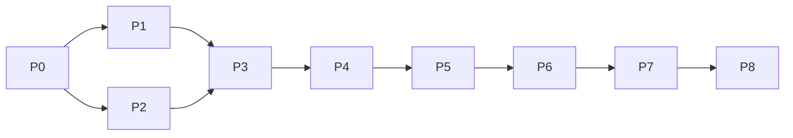

# 04 · Roadmap

Status: draft · Last updated: 2026-09-21

Two weeks ([D-007](08-decision-log.md#d-007--two-week-time-box)), nine phases, one ordering principle: **hand-write an artifact before the LLM can emit one.** Replay, error handling and policy carry the most weight in the brief's evaluation (§7) and are finished while discovery is still a stub. The thin end-to-end thread exists by the end of day 5.

Days are focused sessions, not calendar days. Progress against this plan is tracked in [05-progress-tracker.md](05-progress-tracker.md).

## Phases

### P0 · Foundations (day 1)

- Goal: repo can build, the mock app serves its happy path, and the core types compile.
- Work: `docs/context/`; pnpm workspace with all six packages stubbed; Biome, vitest, tsconfig base; `legacy-bank` login → member search → member detail → open sub-account → confirmation, variant A only, framesets and tables from the start; zod schemas for `Condition`, `TargetSpec`, `Capability`, `ReplayResult`, `AppProfile`, `Policy`.
- Exit: `pnpm dev` starts the mock app; `pnpm test` runs schema tests; the example artifact in [02](02-tech-stack-and-data-model.md#example-artifact) validates.
- Brief: §3.2 schema groundwork.

### P1 · Surface and hand-written replay (day 2)

- Goal: a hand-written capability replays against the mock app with zero LLM.
- Work: `surface-playwright` observe (accessibility snapshot with refs, frame paths, screenshot, dialogs), act, resolve with the three strategies reporting `resolvedBy` and `candidateCount`; filesystem `Store`; replay engine skeleton (preconditions, resolve, act, postcondition wait); event log and screenshots.
- Exit: `handsoff replay --capability get-member-savings-balance --param memberId=10001` returns `success` with the balance and writes a run folder.
- Brief: §3.3 core, §3.5.

### P2 · Discovery (day 3)

- Goal: one real LLM-driven run against the mock app, saved to `/evidence/` immediately.
- Work: `llm-anthropic` planner with strict tools and `{ param }` values; discovery engine loop, stop conditions, stuck detector; redaction of params in observation and transcript; `ScriptedPlanner` for tests.
- Exit: `handsoff discover --goal "..." --param memberId=10001` completes the balance lookup; `evidence/discovery-run/` exists.
- Brief: §3.1, §4 (the non-negotiable real run).

### P3 · Compile and close the thread (days 4–5)

- Goal: the artifact the LLM run produced replays deterministically.
- Work: compile passes (prune, bind by provenance, targets with baseline, postcondition proposal, outputs, provenance, route canonicalisation); versioning with `latest.json`; replay of the compiled artifact; console skeleton showing runs and capabilities read from `data/`.
- Exit: discover → compile → replay round-trips on the mock app with matching outputs. Thread closed.
- Brief: §3.2, §3.3.

### P4 · Conditions and the result contract (days 6–7)

- Goal: every runtime condition in brief §3.3 is detected and answered deliberately.
- Work: chaos modes in the mock app (not-found, validation, session-expiry, interstitial; slow and error if trivial); app profile detectors; the classifier with precedence and budgets; recovery routines (dismiss, wait-retry, rebootstrap); full `ReplayResult` with `sideEffects`, `recoveries`, `stepsRun`; fixture tests over saved observations.
- Exit: replays for not-found, validation, session-expiry and interstitial each produce the expected status; `evidence/replay-member-not-found/` saved.
- Brief: §3.3 error taxonomy, §7 robustness.

### P5 · Policy and redaction (day 8)

- Goal: nothing acts without passing the gate; nothing sensitive is persisted.
- Work: `PolicyGate` with allowlist, action allowlist, live risk classification and mismatch events; network-level origin block; `confirm` handling; screenshot masking from bounding boxes; hashed sensitive values in logs; masked outputs in `result.json`; approval gating of risky steps.
- Exit: an attempted off-allowlist navigation is blocked at both layers with evidence; the risky submit in `open-sub-account` escalates with `CONFIRM_REQUIRED`; grep of `data/` finds no raw member ids.
- Brief: §3.4.

### P6 · Escalation and handoff (days 9–10)

- Goal: a stuck run hands the live session to a human and comes back.
- Work: control-owner state machine in core; escalation record and WebSocket push; console inbox and detail with claim and hand-back; injected human-action capture in the surface; checkpoint-scan resume; `mark_complete` re-extraction; abandonment timeout.
- Exit: `evidence/replay-escalation-handoff/` shows automation pause, a human completing a step in the headed browser, structured human actions in the log, and the run finishing with an `escalation` block.
- Brief: §3.6, §7 human-in-the-loop.

### P7 · Cross-tenant variant, then stretch if time (day 11)

- Goal: one capability, two tenants.
- Work: variant B of the mock app on `:4101` (branding, relabelled buttons, reordered columns); fingerprints and profile-level label and route overrides; capability-level step overrides; `DRIFT_SUSPECTED` on unknown fingerprint. If time remains: assisted fallback behind `policy.assistedFallback`.
- Exit: `evidence/replay-variant-b/` shows the A-recorded capability succeeding on B with the overrides and resolution report.
- Brief: §3.7, §8.

### P8 · Submission (days 12–13)

- Goal: the deliverables in brief §6, exactly as specified.
- Work: `/README.md` (setup, keys, running without live services, the demo commands); `/REPORT.md` with the seven headings in order; curate `/evidence/`; tests where they count (classifier, resolver, gate, schema, control owner); cuts list; final consistency pass over `docs/context/`.
- Exit: a fresh clone follows the README to a successful replay without an API key, and to a discovery run with one.
- Brief: §6, §7 communication and code quality.

### Buffer (day 14)

Reserved. If unused, spend it on multi-run stability (replay N times, report flakiness) rather than new features.

## Dependencies between phases

P1 and P2 can be interleaved once P0 lands; everything from P4 onward is sequential because each phase adds detectors, verdicts or events that the next phase's evidence must include.

## Risks to the plan

| Risk | Mitigation |
|---|---|
| Accessibility snapshot of framesets is messier than expected | P1 exit criterion forces this early; fall back to per-frame snapshots stitched with `framePath` |
| Discovery run needs many iterations of the prompt | `ScriptedPlanner` keeps the engine testable without the API; budget one session of prompt work in P2 |
| Human-action capture misses events in legacy markup | Capture at `document` level in every frame with capture-phase listeners; record a structural path even when roles are missing |
| Time runs out before P7 | Variant B is the only stretch that must land; assisted fallback is already documented as design-only |
